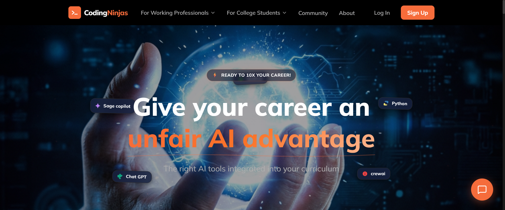

# ⚡ Coding Ninjas Clone - Premium E-Learning Platform

A state-of-the-art e-learning platform clone inspired by the Coding Ninjas redesign. Built with a premium dark-mode aesthetic, rich micro-animations, and interactive user components, this application delivers a highly engaging and responsive UX.



## 🚀 Key Features

*   **Interactive AI Hero Header**:
    *   **Canvas Particles**: Interactive floating nodes and particle connectors canvas.
    *   **3D-Bobbing Tech Cards**: Floating cards (ChatGPT, Python, Node.js, crewAI, Sage Copilot) animated with GSAP bobbing physics and rotation.
    *   **Infinite Marquee**: Smooth infinite scrolling marquee showcasing trending AI skills and integration modules.
*   **Interactive Ninja Assistant**:
    *   A persistent, slide-over AI Chatbot helper featuring quick-question suggestions, real-time message bubble renders, and auto-scrolling chat history.
*   **AI-Powered Course Finder**:
    *   Interactive step-by-step guide widget to help students discover and customize their learning path based on experience, goals, and daily time commitments.
*   **Interactive Career Slider & Stats**:
    *   Salary projection slider comparing non-ninja vs. ninja placements.
    *   Dynamic statistical counter panels highlighting hiring partnerships and average packages.
*   **Unified Auth Flow**:
    *   Global authentication drawer (`AuthDrawer`) sliding in from the right, alongside dedicated full-page Login/Register interfaces with responsive validation feedback.
*   **Rich Page Suites**:
    *   **Courses Catalog**: Filterable course cards categorized by Web Development, Data Science, DSA, and Interview Prep.
    *   **Course Details**: Complete modular breakdown of syllabus, interactive curriculum accordion, pricing, and FAQ.
    *   **About Page**: Milestone timeline tracker and core values visualization.
    *   **Interactive Community**: Active threads, hackathon calendar, and community post streams.

---

## 🛠️ Technology Stack

*   **Core Framework**: React 18 + Vite (Fast HMR)
*   **Styling**: Tailwind CSS (with custom orange/dark palette tokens)
*   **Animations**: GreenSock Animation Platform (GSAP)
*   **Icons**: Lucide React
*   **Linter**: ESLint 9

---

## 📂 Project Structure

```text
CodingNinjas/
├── public/                  # Public assets (SVG icons, favicons)
├── src/
│   ├── assets/              # Static image assets (hero background, etc.)
│   ├── components/
│   │   ├── auth/            # Auth drawer and modal interfaces
│   │   ├── common/          # Reusable UI (Accordion, Buttons, Modals, Assistant)
│   │   ├── courses/         # Course-specific components
│   │   ├── layout/          # Navbar, Footer, Layout wrapper
│   │   └── sections/        # Section-specific components (Hero, Testimonials, etc.)
│   ├── data/                # Mock database json (Courses, Testimonials)
│   ├── hooks/               # Custom React hooks (GSAP wrappers, etc.)
│   ├── pages/               # Page components (Home, Courses, Course Detail, About)
│   ├── utils/               # Tailwinds utility functions (clsx/tailwind-merge helper)
│   ├── App.jsx              # Main App entry with Routing and Auth provider
│   ├── main.jsx             # Main mount script
│   └── index.css            # Global CSS, Tailwind configurations & theme design tokens
├── tailwind.config.js       # Tailwind CSS design system tokens
├── eslint.config.js         # ESLint configuration
└── vite.config.js           # Vite dev configurations
```

---

## 💻 Getting Started

### Prerequisites

*   **Node.js**: `v18.x` or higher
*   **npm**: `v9.x` or higher

### Installation

1.  **Clone the Repository**:
    ```bash
    git clone https://github.com/SARELLA-VENKAT/CodingNinjas.git
    cd CodingNinjas
    ```

2.  **Install Dependencies**:
    ```bash
    npm install
    ```

3.  **Run Development Server**:
    ```bash
    npm run dev
    ```
    *   The app should now be running at `http://localhost:5173`.

4.  **Production Build**:
    ```bash
    npm run build
    ```
    *   Compiles the project and outputs static assets to the `dist/` directory.

---

## 🎨 Theme & Styling System

The application styling follows a dedicated dark theme:
*   **Backgrounds**: `surface-black (#030712)`, `surface-dark (#0f172a)`
*   **Brand Accents**: `brand-orange (#f66c3b)`
*   **Borders & Highlights**: Semi-transparent border utility lines for a premium glassmorphic feel.
